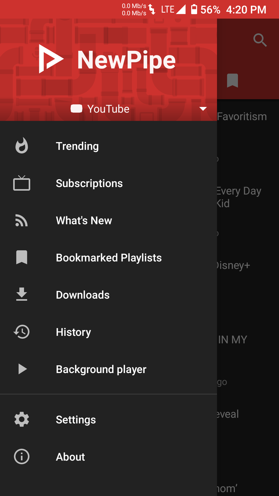
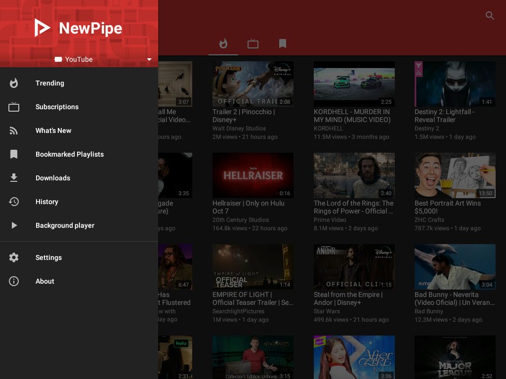

# NewPipe legacy

NewPipe legacy version 0.19.8 with up-to-date NewPipeExtractor dependency

## Description

This repository contains old version 0.19.8 of [NewPipe Android application](https://github.com/TeamNewPipe/NewPipe) with up-to-date [NewPipeExtractor](https://github.com/TeamNewPipe/NewPipeExtractor) dependency.

The application itself heavily relies on the extractor component which is responsible for proper parsing of various video/audio streams, including Youtube site. The old NewPipe version 0.19.8 depends on old extractor version which is practically deprecated and can't handle current Youtube (and similar?) streams, thus rendering the application useless for daily use.

NewPipe version 0.19.8 in this repository uses the current version of NewPipeExtractor and resolves the forementioned issue, thus making it possible to use old NewPipe version 0.19.8 with the current extractor version.

Additionally, direct access to background player window is added to an in-app menu.

Original NewPipe 0.19.8: [GitHub - TeamNewPipe/NewPipe 0.19.8](https://github.com/TeamNewPipe/NewPipe/releases/tag/v0.19.8)

## Motivation

Not so long ago, NewPipe project implemented a new UI elements for video streams. Personally, I didn't like that change. I wanted to keep using the old UI instead.

Another thing with NewPipe is that, you can't access background player from the in-app menus (at least in the old app version). This is an issue with [Anbox](https://github.com/anbox/anbox) because there is no way to access the player controls due to lack of missing Android top-bar (can't swipe) and the Anbox implementation relies on the fact that for each application it renders an independent, single application window. Thus, implementing a way to access background player from the in-app menus works around this issue.

## Screenshots

